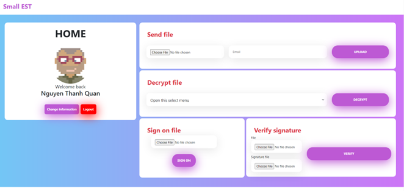

<h1 align="center">
  <br>
  <b>Safe file sharing app</b>
</h1>

<p align="center">An application using cryptography to secure sharing files</p>

<p align="center">
  <b>
    <a href="./document/PRJ1-Encryption.pdf">Project overview</a> •
    <a href="./document/Report.pdf">Report</a> •
    <a href="#key-features">Key Features</a> •
    <a href="#getting-start">Getting Start</a> •
  </b>
</p>

<p align="center">
  </img>
</p>

## Key Features

-  En/Decrypt file with RSA
-  Update user's key
-  Friendly UI

## Getting Start

### Environment Variables

To run this project, you need to add the following environment variables to your `.env` file in `/`:

-  **App configs:** Create `.env` file in `./`

   -  `MONGO_URI`: URI of MongoDB database
   -  `MONGO_PORT`: Port of MongoDB database
   -  `APP_PORT`: Port of Flask application
   -  `SECRET_KEY`: a key used by Flask to encrypt and sign session data.
   -  `SALT_LENGTH`: Length of salt to verify files

   Example:

   ```sh
    # .env
    MONGO_URI=mongodb+srv://mongo_uri
    MONGO_PORT=5000
    APP_PORT=3000
    SECRET_KEY="secret"
    SALT_LENGTH=32
   ```

You can also check out the file `.env.example` to see all required environment variables.

> **Note**: If you want to use this example environment, you need to rename it to `.env`.

### Run Locally

To clone and run this application, you'll need [Git](https://git-scm.com) and [Python](https://www.python.org/downloads/) installed on your computer. From your command line:

```bash
# Clone this repository
git clone https://github.com/HCMUS-Project/Safety-application.git

# Go into the repository
cd Safety-application

# Install libraries
pip install -r requirements.txt

# Run the app
python app.py
```

> **Note**
> If you're using Linux Bash for Windows, [see this guide](https://www.howtogeek.com/261575/how-to-run-graphical-linux-desktop-applications-from-windows-10s-bash-shell/) or use `node` from the command prompt.

---

> Bento [@quanblue](https://bento.me/quanblue) &nbsp;&middot;&nbsp;
> GitHub [@QuanBlue](https://github.com/QuanBlue) &nbsp;&middot;&nbsp; Gmail quannguyenthanh558@gmail.com
